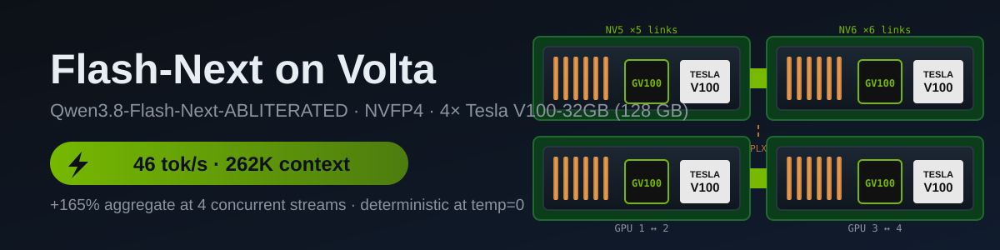
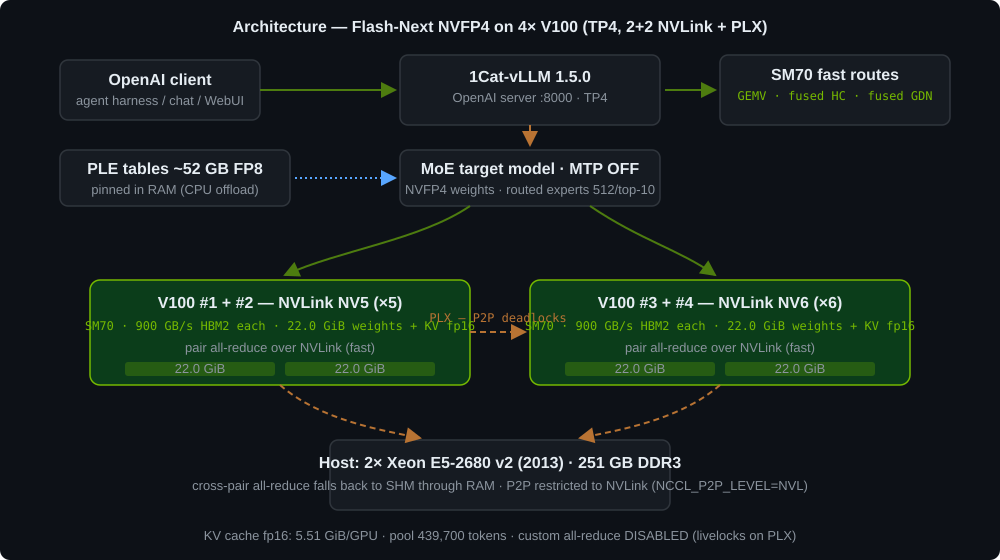
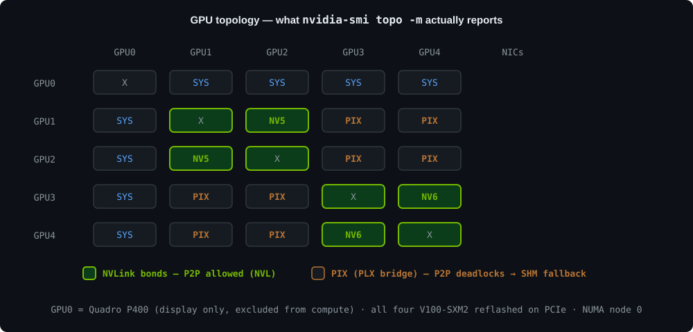
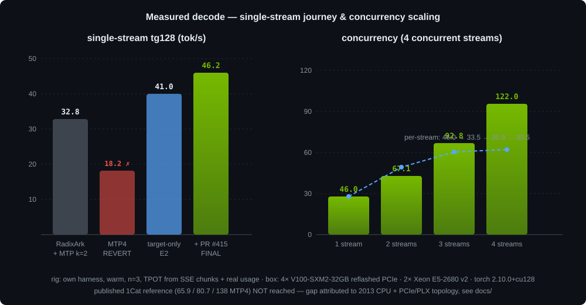

<div align="center">



# ⚡ Flash-Next on Volta — 4×V100 runbook

**Qwen3.8-Flash-Next-ABLITERATED in native NVFP4 on 4× Tesla V100-32GB — 262,144-token context, 46 tok/s decode, OpenAI-compatible, agent-ready**

[](https://github.com/1CatAI/1Cat-vLLM)
[](https://github.com/1CatAI/1Cat-vLLM)
[](#-the-model)
[](#-long-context--what-262k-actually-looks-like)
[](#-measured-results)
[](#license)

</div>

---

Four 2017 datacenter GPUs, a 2013 dual-Xeon host, and a frontier hybrid model
running at **its full 262K context** — measured, validated, deterministic.
This repo is the complete runbook of how it was built: every pitfall, every
rejected experiment (with evidence), and the exact configuration that survived
an 18-stage optimization program.

## 🧱 What this is (and what it isn't)

This is a **runbook + benchmark archive + launcher scripts**, built entirely on
upstream work — full credit:

| Piece | Project | Role |
|---|---|---|
| 🚀 Engine | [**1CatAI/1Cat-vLLM**](https://github.com/1CatAI/1Cat-vLLM) `1.5.0` | vLLM fork dedicated to SM70 (`FLASH_ATTN_V100` backend, PLE CPU-offload route, SM70 fast routes) |
| ⚡ Kernels | `flash_attn_v100` 1.2.0 | DFlash2 attention for Volta |
| 📦 Weights | [**dealignai/Qwen3.8-Flash-Next-ABLITERATED-NVFP4**](https://huggingface.co/dealignai/Qwen3.8-Flash-Next-ABLITERATED-NVFP4) `@be794b9` | refusal-removal (weight-space) variant of Qwen3.8-Flash-Next, ModelOpt NVFP4 (pinned revision) |
| 🧮 Quantization | NVIDIA ModelOpt | NVFP4 weights (routed experts 512/top-10, group 16), FP8 PLE tables, complete 31/31 MTP tensor set |

> **Note on the checkpoint.** This is an *abliterated* model (refusal
> directions removed at the weight level). We picked it for engineering
> reasons — it is the only NVFP4 Flash-Next repack that is **byte-structural
> identical** to the stock RadixArk checkpoint (zero config diff, complete MTP
> weights), making it a drop-in swap. If you want the stock model, the same
> runbook applies to `RadixArk/Qwen3.8-Flash-Next-NVFP4` — we benchmarked both
> (see [docs/](docs/)).

## 🗺️ Architecture



The interesting part is the interconnect. These are **SXM2 cards reflashed onto
PCIe** (common on the refurbished market) — each pair keeps its NVLink bond,
but the pairs talk to each other through a PLX PCIe bridge:



And that topology drives almost every fix in this repo — the P2P path through
the PLX bridge **passes NCCL init and deadlocks on the first collective**, and
vLLM's custom all-reduce spin-waits forever on it.

## 🚨 Why this repo exists — the 4-GPU gap

The published SM70 recipe assumes either full NVLink mesh or a single pair.
On **2+2 NVLink + PLX**, on a **2013 CPU**, the stock instructions fail or
silently underperform in **eight** distinct ways — each measured, each with a fix:

| # | 😵 Symptom | 🩹 Fix | Cost of not knowing |
|---|---|---|---|
| 1 | Boot hangs right after first NCCL collective — GPUs spin at 100% forever | `NCCL_P2P_LEVEL=NVL` (P2P only on NVLink bonds; cross-pair falls back to host SHM) | unbootable |
| 2 | CUDA-graph capture livelock, log frozen | `--disable-custom-all-reduce` | unbootable |
| 3 | First request crashes: Triton can't compile its launcher — `Python.h` missing (no sudo, no python3-dev on the box) | `CPATH`/`LIBRARY_PATH` → headers from any ABI-compatible conda python | crash on first token |
| 4 | MTP speculative decoding is **slower at every depth** (k=2 ≈ break-even, k=4 = **−56%**) | run **target-only** (MTP OFF) | −56% decode |
| 5 | Decode stuck ~13% under the hardware ceiling | three **default-OFF** env routes from PR #415 (`GEMV`, fused HC, fused GDN-input) | −13% decode forever |
| 6 | `--max-num-seqs 1` serializes every concurrent request | `max-num-seqs 4` — free parallelism, single-stream unaffected (measured) | queueing under any concurrency |
| 7 | systemd drop-in "unsets" a variable by commenting it out — it does **not** (`Environment=` accumulates; only same-name override works) | explicit override + re-measure | phantom config, wasted debugging |
| 8 | Unit file says one thing, running process does another | discovered during E0 audit: the **authoritative config lived in a drop-in**, not the unit | wrong mental model of your own system |

Fixes 1–6 are baked into [setup/](setup/). Fixes 7–8 are systemd lessons —
see [docs/SYSTEMD-LESSONS.md](docs/SYSTEMD-LESSONS.md).

## 📊 Measured results

Box: 4× Tesla V100-SXM2-32GB (reflashed PCIe) · 2× Xeon E5-2680 v2 · 251 GB DDR3 ·
driver 580.173.02 · Ubuntu 24.04 · torch 2.10.0+cu128 · TP4 · MTP OFF · fp16 KV · GMU 0.92



### Decode — single stream (temp 0/0.3, short prompt, warm, n=3)

| Configuration | tg128 | tg256 | chat |
|---|---|---|---|
| RadixArk stock + MTP k=2 (program baseline) | 32.8 | 33.6 | 43.2 |
| dealignai + MTP k=2 | 33.1 | 33.4–34.4 | 40.2–40.6 |
| dealignai + **MTP4** ❌ (rejected, see below) | 18.2 | 18.2 | 18.2 |
| target-only (E2) | 41.0 | 40.8 | 41.2 |
| **target-only + PR #415 flags (FINAL)** | **46.2** | **45.8** | **46.1** |

### Concurrency — 4 concurrent streams (prompt 23 tok, 256 out, warm, n=3)

| Streams | per-stream | aggregate | TTFT |
|---|---|---|---|
| 1 | 46.0 | 46.0 | 0.33 s |
| 2 | 33.5 | 67.1 (+46%) | 0.46 s |
| 3 | 30.9 | 92.8 (+102%) | 0.55 s |
| 4 | 30.5 | **122.0 (+165%)** | 0.58 s |

Single-stream speed is **identical** with `max-num-seqs 4` (46.0 measured on
the MNS=4 server) — the tolerance costs nothing.

### Long context — what 262K actually looks like

| Test | Result |
|---|---|
| Needle-in-haystack 32K/64K/128K/196K × depths 10/50/90% | **6/6 PASS** (code recovered exactly) |
| Real request: 256,512-token prompt + reply | **PASS** (limit 262,144 total) |
| Decode @ 32K / 196K / 256K | 40.6 / 37.7 / 35.7 tok/s |
| Single prefill 32K / 139K / 209K / 256K | ~1,100 / 2,123 / 2,335 / 1,631 tok/s |
| KV pool (allocator-reported) | **439,700 tokens** (177K headroom over MML) |
| Determinism temp=0, 10 runs | **10/10 identical** |
| Quality gates | math 4/4, code, Romanian, English — PASS |

GPUs during decode: 1530 MHz full boost, 92–99% util, **only ~110 W of 250 W
TDP**, 46–56 °C — no thermal/power throttling; the silicon has headroom the
stack can't feed (that's the 2013 CPU talking).

> ⚠️ Tokenizing a 256K-token prompt is CPU-bound: **60–90 s** before the first
> prefill chunk. One-time cost per request; cached prefixes skip it.

## 🔬 The 18-stage optimization program (E0–E17)

Everything above came out of a strict methodology: **baseline → one change →
measure → KEEP/REVERT**. Full log in
[docs/OPTIMIZATION-PROGRAM.md](docs/OPTIMIZATION-PROGRAM.md); the digest:

| Stage | Experiment | Result | Decision |
|---|---|---|---|
| E0 | audit | authoritative config lived in a systemd **drop-in**, not the unit; 3 dead env vars from the 1.2.2 era | KEEP (knowledge) |
| E1 | model verification | NVFP4 ModelOpt, MTP 31/31, PLE fp8, byte-identical structure to stock | KEEP |
| E2 | target-only baseline | 41 tok/s, KV pool 439,700 | KEEP |
| E3 | `numactl -N 0` NUMA pinning | 0% difference | **REVERT** |
| E4 | GMU 0.92 | weights 22.0 GiB + KV 5.51 GiB per GPU | KEEP |
| E5 | MML 262,144 | validated (table above) | KEEP |
| E6–E8 | FP8 E4M3 KV cache (upstream port) | would **disable** the fast SM70 path `xqa_page4` (fp16 gate); 262K already reached in fp16 | **REJECT** unimplemented (patch archived in [`patches/`](patches/)) |
| E9 | MTP depth 4 | 18.2 vs 41 tok/s; acceptance 2.17–2.20/5; ~2.3 forward passes per accepted token → each pass ≈ 24.4 ms **GPU-bound** — the draft overhead is CPU-bound on the 2013 Xeon | **REVERT** |
| E10–E11 | all-reduce & CUDA-graph audit | `--disable-custom-all-reduce` + NCCL/NVL is the optimum available without a CUDA build | concluzie |
| E12 | BFLA sparse prefill | experimental, quality risk | omitted |
| E13 | BALANCED profile | single optimum exists; no point | omitted |
| PR #415 | three default-off fast routes | **+13% decode (41→46)**, quality PASS, determinism 10/10 | **KEEP** |
| E18/CONC-B | concurrency 1–4 streams | table above; single-stream unaffected | **KEEP** MNS=4 |

**Honest gap:** the published 1Cat reference for this exact GPU count
(65.9 tok/s control / 80.7 optimized / 138 MTP4) was **not** reached. The
measured evidence points at the host (CPU-bound draft dispatch and split-ops)
plus the PCIe/PLX topology — not at the GPUs, which sit at 110 W with 92–99%
utilization. Our estimate for a modern CPU swap on this box: +5–15% decode,
3–5× tokenizer speedup. Open questions for the upstream authors are listed in
[docs/EXTERNAL-CONSULT.md](docs/EXTERNAL-CONSULT.md).

## ✅ Requirements

- **4× Tesla V100 32GB** (SM70) — SXM2-reflashed-on-PCIe works; topology notes below
- NVIDIA driver ≥ 570 (580.173.02 used here) · Ubuntu 24.04
- **Python 3.12** venv with the pinned 1Cat-vLLM 1.5.0 wheel
- ~160 GB free disk for the checkpoint (135 GB) + venv + caches
- RAM: 251 GB here; the PLE CPU-offload route pins ~52 GB, so ≥ 96 GB is prudent
- The four GPUs free of other inference processes; a display GPU on index 0 is fine (excluded via `CUDA_VISIBLE_DEVICES`)

### Topology prerequisites

```bash
nvidia-smi topo -m
```

You want two NVLink-connected pairs (`NV#` bonds) and `PIX`/`PXB` between
them — exactly what this repo's NCCL settings are tuned for. On a full
NVLink mesh you can likely relax `NCCL_P2P_LEVEL=NVL`; **re-measure before
keeping any change**.

## 🚀 Quick start

```bash
git clone https://github.com/Redhatvale/4xV100-qwen38-flash-next-abliterated-128gb-vram && cd 4xV100-qwen38-flash-next-abliterated-128gb-vram
```

1. Create the venv and install 1Cat-vLLM 1.5.0 per
   [upstream instructions](https://github.com/1CatAI/1Cat-vLLM) (wheel for
   cp312; verify its SHA256).
2. Download the checkpoint (revision `be794b990578`, 135 GB, 206 shards).
3. Export the env block from [setup/serve-production.sh](setup/serve-production.sh)
   (it's the tuned configuration), then:
   ```bash
   export VLLM_API_KEY=choose-a-long-random-string
   bash setup/serve-production.sh      # serves http://0.0.0.0:8000/v1
   ```
   First boot compiles Triton launchers + CUDA graphs — several minutes;
   subsequent boots are faster. The PLE tables (~52 GB) are pinned into RAM
   at boot (`VLLM_PLE_CPU_OFFLOAD=1`) — that's expected and takes a while.

> ⚠️ **Authentication.** The server is started with `--api-key` and listens
> on `0.0.0.0`. Keep the key long and private; for anything beyond localhost
> put a reverse proxy with TLS in front.

### 🧪 Smoke test

```bash
curl http://127.0.0.1:8000/v1/chat/completions -H "Authorization: Bearer $VLLM_API_KEY" -H 'Content-Type: application/json' -d '{
  "model":"qwen3.8-flash-next","max_tokens":48,"temperature":0,
  "messages":[{"role":"user","content":"Reply in 5 words: what model are you?"}],
  "chat_template_kwargs":{"enable_thinking":false}}'
```

### 📏 Benchmark

```bash
python3 benchmarks/bench_rig.py --base-url http://127.0.0.1:8000/v1 \
  --api-key "$VLLM_API_KEY" --suite quick --tag my-run --outdir /tmp/results
# concurrency:
python3 benchmarks/bench_conc.py --base-url http://127.0.0.1:8000/v1 \
  --api-key "$VLLM_API_KEY" --levels 1,2,3,4 --tag my-conc --outdir /tmp/results
```

## 🖥️ Test WebUI

Zero-dependency chat UI with streaming and a **live tok/s counter** (counts
tokens via `stream_options.include_usage`, not chunks):

```bash
python3 -m http.server 8087 --bind 127.0.0.1 --directory webui
# → http://127.0.0.1:8087
```

## 🔧 Configuration (serve-production.sh)

| Env | Default | Meaning |
|---|---|---|
| `CUDA_VISIBLE_DEVICES` | `1,2,3,4` | the four V100s (index 0 = display GPU here) |
| `VLLM_PLE_CPU_OFFLOAD` | `1` | pin ~52 GB FP8 PLE tables in RAM (official SM70 route) |
| `NCCL_P2P_LEVEL` | `NVL` | P2P restricted to NVLink; cross-pair → SHM (PLX P2P deadlocks) |
| `VLLM_SM70_QWEN38_FP16_GEMV` | `1` | PR #415 fast route — fp16 GEMV projections |
| `VLLM_SM70_QWEN38_FUSED_HC_FP16` | `1` | PR #415 fast route — fused HC modules |
| `VLLM_SM70_QWEN38_FUSED_GDN_INPUT_FP16` | `1` | PR #415 fast route — fused GDN input |
| `MML` (fast launcher) | `65536` | small-context boot: faster start, bigger per-session KV pool |

Flags: `--tensor-parallel-size 4 --attention-backend FLASH_ATTN_V100
--max-model-len 262144 --max-num-seqs 4 --max-num-batched-tokens 8192
--gpu-memory-utilization 0.92 --disable-custom-all-reduce
--enable-auto-tool-choice --tool-call-parser qwen3_coder
--trust-remote-code --language-model-only --dtype half`

## 🧭 The road here (short version)

This box evolved in public steps — each has its own repo or note:

1. **llama.cpp era** — GGUF Q8_0 + DFlash2 speculative on Volta: ≈ 43 tok/s on 2 GPUs.
2. **TP2 NVFP4** — [`Redhatvale/Nvidia-Tesla-v100-nvfp4-pcie`](https://github.com/Redhatvale/Nvidia-Tesla-v100-nvfp4-pcie): 1Cat-vLLM 1.2.2, 2× PCIe V100, 61–74 tok/s — that repo's three PCIe blockers (ninja, NCCL P2P, custom-AR) are prerequisites for this one.
3. **+2 V100, Flash-Next** — this repo: TP4, 1.5.0, 262K context, the full E0–E17 program, PR #415, concurrency.

## 📚 Docs

| File | What's inside |
|---|---|
| [docs/OPTIMIZATION-PROGRAM.md](docs/OPTIMIZATION-PROGRAM.md) | the full E0–E17+E18 log with per-stage evidence |
| [docs/CONCURRENCY.md](docs/CONCURRENCY.md) | CONC-B rig and results in detail |
| [docs/EXTERNAL-CONSULT.md](docs/EXTERNAL-CONSULT.md) | open questions handed to external review (incl. the 65.9/80.7/138 reference gap) |
| [docs/SYSTEMD-LESSONS.md](docs/SYSTEMD-LESSONS.md) | the two systemd traps that cost us debugging time |
| [benchmarks/results/](benchmarks/results/) | raw benchmark JSONLs + summaries (every number above is reproducible from these) |

## License

Apache-2.0 — same as vLLM. The checkpoint weights are governed by their own
Hugging Face license.
